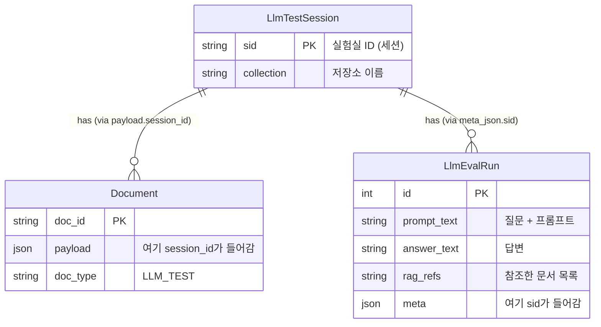

## LLM TEST Session 


### 세션별 격리 방식
```
📂 LLM_TEST_COLLECTION (통은 하나지만 태그로 구분됨)
│
├── 🏷️ Session A (sid: 1234)  <-- 사용자 A의 실험실
│     ├── 📄 문서1.pdf
│     └── 📄 문서2.pdf
│
└── 🏷️ Session B (sid: 5678)  <-- 사용자 B의 실험실
      ├── 📄 문서3.pdf
      └── 📄 문서4.pdf
```

### 현재 DB 구조의 연결 관계


1. 실험실 (LlmTestSession)
    - sid: 실험실의 고유 번호판
    - 이 세션이 생성될 때 사용한 설정(디렉토리 경로, 컬렉션 이름 등)을 담고 있음
2. 문서 (Document)
    - 사용자가 해당 실험실에 올린 파일들
    - 우리가 documents.py를 수정해서 extra_payload={'session_id': sid}를 넣으려는 이유가 바로, "이 문서는 이 실험실 소유다"라고 명찰을 달아주기 위함임
3. 질문과 답변 (LlmEvalRun)
    - LlmEvalRun 테이블은 테스트 실행 기록(질문, 답변, 점수 등)을 저장
    - 현재 manage_test_LLM.py의 ensure_eval_on_shared_session 함수에서, 결과를 저장할 때 meta_json 필드에 {"sid": sid, ...}를 같이 저장.
    - 즉, "이 질문과 답변은 이 실험실에서 나온 것이다"라는 기록이 이미 남음.

